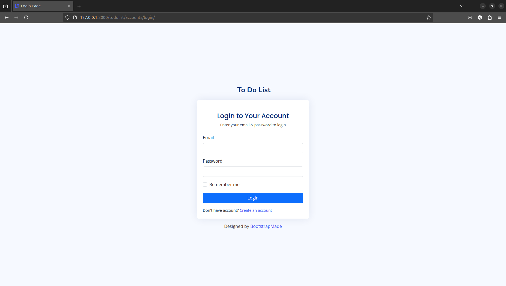
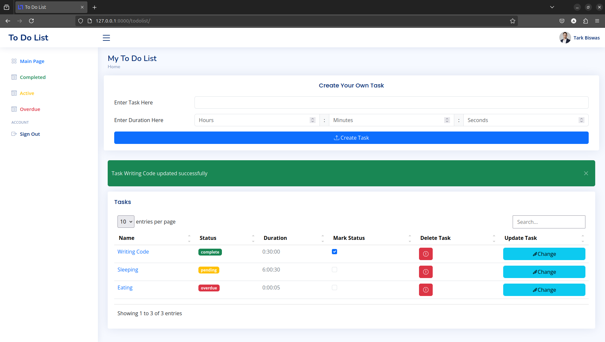

# To Do Page using Django 

Implementing a basic To Do website

## Features

- User can register and login to access their own tasks.
- User can add tasks along with amount of time 
- User can delete tasks
- User can update task as complete and pending
- User can also update the task name and also set a new amount of time. Note that simply updating without entering values will still reset the duration for the task. 
- After set amount of time for a task passes, task is marked as overdue

## Assets Used

[Nice Admin](https://bootstrapmade.com/nice-admin-bootstrap-admin-html-template/) - An admin and dashboard template based latest version of Bootstrap framework, provided by BootstrapMade

## Screenshot

<figure>
    
    <ficaption>Login Page</figcaption>
</figure>

<figure>
    
    <ficaption>Main Page Layout</figcaption>
</figure>